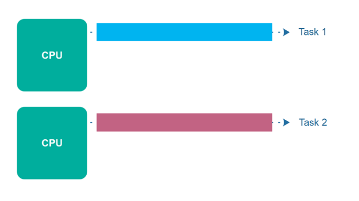

# Concurrency ✅

- [Яндекс: ШМР - Потоки и асинхронность](https://www.youtube.com/watch?v=e_NOYbGwI-g)
- [Oracle - Java Concurrency Tutorial](https://docs.oracle.com/javase/tutorial/essential/concurrency/index.html)
- [Jenkov - Java Concurrency and Multithreading Tutorial](https://jenkov.com/tutorials/java-concurrency/index.html)

**<u>Concurrency</u>** is the ability of different parts or units of a program, algorithm, or problem to be executed out-of-order or in partial order, without affecting the outcome.

[*Java Concurrency*](https://jenkov.com/tutorials/java-concurrency/index.html) is a term that covers *multithreading*, *concurrency* and *parallelism* on the Java platform. That includes the Java concurrency tools, problems and solutions.

### [Concurrency vs. Parallelism](https://jenkov.com/tutorials/java-concurrency/concurrency-vs-parallelism.html)

**<u>Multithreading</u>** means that you have multiple _threads of execution_ inside the same application. **<u>Concurrency</u>** means that an application is making progress on more than one task - at the same time (concurrently).

  
[**Parallel computing**](https://en.wikipedia.org/wiki/Parallel_computing) is a type of computation in which many calculations or processes are carried out simultaneously. Parallel execution is when a computer has more than one CPU or CPU core, and makes progress on more than one task simultaneously.

It is possible to have parallel concurrent execution, where threads are distributed among multiple CPUs. Thus, the threads executed on the same CPU are executed concurrently, whereas threads executed on different CPUs are executed in parallel.

A **<u>parallelism</u>** means that an application splits its tasks up into smaller subtasks which can be processed in parallel, for instance on multiple CPUs at the exact same time. Thus, parallelism does not refer to the same execution model as parallel concurrent execution.

### [Concurrency Models](https://jenkov.com/tutorials/java-concurrency/concurrency-models.html)

A **<u>concurrency model</u>** specifies how threads in the the system collaborate to complete the tasks they are are given. Different concurrency models split the tasks in different ways, and the threads may communicate and collaborate in different ways.

A **<u>state</u>** is some data, typically one or more objects. **<u>Shared</u>**/**<u>Separate</u>** *state* means that the different threads in the system will share / do not share some state among them.

The most common *cuncurrency models* are:
#### Parallel workers

A *delegator* distributes the incoming jobs to different *workers*. Each worker completes the full job. The workers work in parallel, running in different threads, and possibly on different CPUs.

( + ) The advantage of this model is: to increase the parallelization level of the application you just add more workers.

( - ) The disadvantages of this model are related with shared state concurrency problems: race conditions problem, deadlock, waiting for accessing the blocking shared data structures and so on.

#### Assembly Line

The workers are organized like workers at an assembly line in a factory. Each worker only performs a part of the full job. When that part is finished the worker forwards the job to the next worker. Systems using an assembly line concurrency model are also sometimes called _reactive systems_, or _event driven systems_. The system's workers react to events occurring in the system, either received from the outside world or emitted by other workers.

( + ) The advantages of this model are: *no shared state* (implementing a worker as if it was a singlethreaded implementation), *stateful workers* (can keep the data they need to operate in memory, since no other threads modify their data), *better hardware conformity* (more optimized data structures and algorithms when singlethreaded mode), *job ordering is possible* (much easier to track the state of a system at any time).

( - ) The main disadvantage of this model is that the execution of a job is often spread out over multiple workers, and thus over multiple classes in your project. Worker code is sometimes written as callback handlers: nested callback, _callback hell_.

#### Functional parallelism

A program is implemented with function calls. Functions are "agents" or "actors" that send messages to each other, just like in the assembly line concurrency model (AKA reactive or event driven systems). All parameters passed to the function are copied, so no entity outside the receiving function can manipulate the data. This copying is essential to avoiding race conditions on the shared data. This makes the function execution similar to an atomic operation. Each function call can be executed independently of any other function call, so each function call can be executed on separate CPUs. The hard part about functional parallelism is knowing which function calls to parallelize.

### [Process and Thread](https://docs.oracle.com/javase/tutorial/essential/concurrency/procthread.html)

In concurrent programming, there are two basic units of execution: **<u>processes</u>** and **<u>threads</u>**.

- **<u>Process</u>** - an application instance during runtime.
	- Has a self-contained **execution environment**.
	- Has a complete, private set of basic run-time resources: its own **memory space**.
	- To facilitate communication between processes, most OSs support _Inter Process Communication_ (IPC) resources, such as *pipes* and *sockets*.
	- Most implementations of the JVM run as a single process. A Java application can create additional processes using a [`ProcessBuilder`](https://docs.oracle.com/javase/8/docs/api/java/lang/ProcessBuilder.html) object.
- **<u>Thread</u>** - A set of instructions, which are executed consecutively
	- Also provide an execution environment
	- Sometimes called _lightweight processes_: requires fewer resources than creating a new process.
	- Threads exist within a process — every process has at least one. Threads share the process's resources, including memory and open files.
	- Every application has at least one thread: _main thread_, that has the ability to create additional threads.

```mermaid
flowchart TB
    L[Linux Kernel]
    subgraph PA [Process A]
        RA[PID\nAddress Space\nMemory]
        TA1(Thread A1)
        TA2(Thread A2)
        TA3(Thread A3)
    end
    L --> PA
    subgraph PB [Process B]
        RB[PID\nAddress Space\nMemory]
        TB1(Thread B1)
        TB2(Thread B2)
        TB3(Thread B3)
    end
    L --> PB
    subgraph PC [Process C]
        RC[PID\nAddress Space\nMemory]
        TC1(Thread C1)
        TC2(Thread C2)
        TC3(Thread C3)
    end
    L --> PC
```

A process may run on different CPUs:

A single CPU switches between all threads launched on this CPU. The switching time \[C\] is essential.

